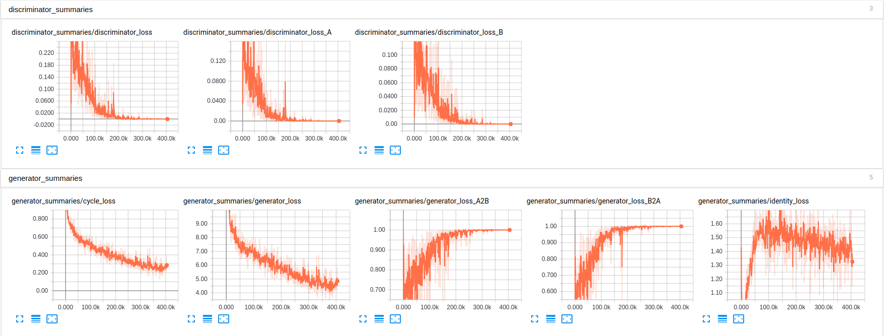

# Nonparallel Voice Conversion using CycleGAN

## Introduction

This is a tensorflow implementation of Takuhiro Kaneko's paper PARALLEL-DATA-FREE VOICE CONVERSION USING CYCLE-CONSISTENT ADVERSARIAL NETWORKS. CycleGAN is a generative model developed for unpaired image-to-image translation. It assumes the existence of a cycle-consistency mapping that an image in the source domain mapped to a target domain and mapped back will be exactly the same as the original image. 

### Assumption and Loss
1. Adversarial loss         (naturalness)
2. Cycle-consistency loss   (speaker similarity)
3. Identity mapping loss    (color/linguistic information preservation)

### Neural Network Representation
When applied for voice conversion, gated linear units (GLUs) are used as activation function to capture the sequential and hierarchical structures of speech.  It allows the information to be selectively propagated based on the previous layer states. The generator is 1D CNN focusing on temporal structure, and the discriminator is 2D CNN focusing on spectral texture. The model consists of the following architecture

<p align="left">
    
</p>

### Features:
1. Fundamental frequency (log F_0), converted by logarithm Gaussian normalized transformation
2. Mel-cepstral coefficients (MCEPs), a representation of spectral envelope, trained by CycleGAN
3. Aperiodicities (APs), directly used without modification

### Dataset: 
[Voice Conversion Challenge 2016](https://datashare.is.ed.ac.uk/handle/10283/2211) <br />
Professional US English speakers, five females and five males,  each has 216 short sentences (~13 minutes, need manual segmentation)
Aource: A pair of female (SF1) and male (SM1), 81 sentences for training
Target: Another pair (TF2 and TM3), 81 sentences for training; 54 sentences for evaluation

### Toolbox for feature extraction and waveform reconstruction: 
[WORLD](https://github.com/mmorise/World)

## Files

```
.
├── convert.py
├── demo
├── download.py
├── figures
├── model.py
├── module.py
├── preprocess.py
├── README.md
├── train_log
├── train.py
└── utils.py
```

## Usage

### Dependencies

* Python 3.5
* Numpy 1.14
* TensorFlow 1.8
* ProgressBar2 3.37.1
* LibROSA 0.6
* FFmpeg 4.0
* [PyWorld](https://github.com/JeremyCCHsu/Python-Wrapper-for-World-Vocoder)

(Issue: wrong TensorFlow version --> export PYTHONNOUSERSITE=True) <br />
(Issue: wrong jupyter notebook python kernel --> Install the IPython kernel in different env)

### Download Dataset

Download and unzip [VCC2016](https://datashare.is.ed.ac.uk/handle/10283/2211) dataset to designated directories.

```bash
$ python download.py --help
usage: download.py [-h] [--download_dir DOWNLOAD_DIR] [--data_dir DATA_DIR]
                   [--datasets DATASETS]

Download CycleGAN voice conversion datasets.

optional arguments:
  -h, --help            show this help message and exit
  --download_dir DOWNLOAD_DIR
                        Download directory for zipped data
  --data_dir DATA_DIR   Data directory for unzipped data
  --datasets DATASETS   Datasets available: vcc2016
```

For example, to download the datasets to ``download`` directory and extract to ``data`` directory:

```bash
$ python download.py --download_dir ./download --data_dir ./data --datasets vcc2016
```

### Train Model
Data preprocessing takes about 10 mins, depends on the data size. <br />
To have a good conversion quality, the training needs to take at least 1000 epochs. With a TITAN X, it takes 2 days to finish all 400K iterations. The learning rate is constant in iteration 0-200K and linearly drop to zero in 200K-400K. 

```bash
$ python train.py --help
usage: train.py [-h] [--train_A_dir TRAIN_A_DIR] [--train_B_dir TRAIN_B_DIR]
                [--model_dir MODEL_DIR] [--model_name MODEL_NAME]
                [--random_seed RANDOM_SEED]
                [--validation_A_dir VALIDATION_A_DIR]
                [--validation_B_dir VALIDATION_B_DIR]
                [--output_dir OUTPUT_DIR]
                [--tensorboard_log_dir TENSORBOARD_LOG_DIR]

Train CycleGAN model for datasets.

optional arguments:
  -h, --help            show this help message and exit
  --train_A_dir TRAIN_A_DIR
                        Directory for A.
  --train_B_dir TRAIN_B_DIR
                        Directory for B.
  --model_dir MODEL_DIR
                        Directory for saving models.
  --model_name MODEL_NAME
                        File name for saving model.
  --random_seed RANDOM_SEED
                        Random seed for model training.
  --validation_A_dir VALIDATION_A_DIR
                        Convert validation A after each training epoch. If set
                        none, no conversion would be done during the training.
  --validation_B_dir VALIDATION_B_DIR
                        Convert validation B after each training epoch. If set
                        none, no conversion would be done during the training.
  --output_dir OUTPUT_DIR
                        Output directory for converted validation voices.
  --tensorboard_log_dir TENSORBOARD_LOG_DIR
                        TensorBoard log directory.
```

For example, to train CycleGAN model for voice conversion between ``SF1`` and ``TM1``:

```bash
$ python train.py --train_A_dir /media/jg/H/data/VCC2016/vcc2016_training/SF1 --train_B_dir /media/jg/H/data/VCC2016/vcc2016_training/TM1 --model_dir ./model/sf1_tm1 --model_name sf1_tm1.ckpt --random_seed 0 --validation_A_dir /media/jg/H/data/VCC2016/evaluation_all/SF1 --validation_B_dir /media/jg/H/data/VCC2016/evaluation_all/TM1 --output_dir ./validation_output --tensorboard_log_dir ./log
```


<p align="center">
    
</p>

We can listen to the converted audio in folder ``validation_output``, and compare with the original files in ``validation_A_dir`` and ``validation_B_dir``. 


### Voice Conversion

Convert voices using pre-trained models.

```bash
$ python convert.py --help
usage: convert.py [-h] [--model_dir MODEL_DIR] [--model_name MODEL_NAME]
                  [--data_dir DATA_DIR]
                  [--conversion_direction CONVERSION_DIRECTION]
                  [--output_dir OUTPUT_DIR]

Convert voices using pre-trained CycleGAN model.

optional arguments:
  -h, --help            show this help message and exit
  --model_dir MODEL_DIR
                        Directory for the pre-trained model.
  --model_name MODEL_NAME
                        Filename for the pre-trained model.
  --data_dir DATA_DIR   Directory for the voices for conversion.
  --conversion_direction CONVERSION_DIRECTION
                        Conversion direction for CycleGAN. A2B or B2A. The
                        first object in the model file name is A, and the
                        second object in the model file name is B.
  --output_dir OUTPUT_DIR
                        Directory for the converted voices.
```

To convert voice, put wav-formed speeches into ``data_dir`` and run the following commands in the terminal, the converted speeches would be saved in the ``output_dir``:

```bash
$ python convert.py --model_dir ./model/sf1_tm1 --model_name sf1_tm1.ckpt --data_dir ./data/evaluation_all/SF1 --conversion_direction A2B --output_dir ./converted_voices
```
The convention for ``conversion_direction`` is that the first object in the model filename is A, and the second object in the model filename is B. In this case, ``SF1 = A`` and ``TM1 = B``.

## Demo

### VCC2016 SF1 and TF2 Conversion

In the ``demo`` directory, there are voice conversions between the validation data of ``SF1`` and ``TF2`` using the pre-trained model.

``200001_SF1.wav`` and ``200001_TF2.wav`` are real voices for the same speech from ``SF1`` and ``TF2``, respectively.

``200001_SF1toTF2.wav`` and ``200001_TF2.wav`` are the converted voice using the pre-trained model.

``200001_SF1toTF2_author.wav`` is the converted voice from the [NTT](http://www.kecl.ntt.co.jp/people/kaneko.takuhiro/projects/cyclegan-vc/) website for comparison with our model performance.

The conversion performance is extremely good and the converted speech sounds real to me.

Download the pre-trained SF1-TF2 conversion model and conversion of all the validation samples from [Google Drive](https://drive.google.com/open?id=1SwiK9X3crXU4_-aM_-Sff1T82d6-1SEg).


## Reference

* Takuhiro Kaneko, Hirokazu Kameoka. Parallel-Data-Free Voice Conversion Using Cycle-Consistent Adversarial Networks. 2017. (VCCycleGAN)
* Wenzhe Shi, Jose Caballero, Ferenc Huszár, Johannes Totz, Andrew P. Aitken, Rob Bishop, Daniel Rueckert, Zehan Wang. Real-Time Single Image and Video Super-Resolution Using an Efficient Sub-Pixel Convolutional Neural Network. 2016. (Pixel Shuffler)
* Yann Dauphin, Angela Fan, Michael Auli, David Grangier. Language Modeling with Gated Convolutional Networks. 2017. (Gated CNN)
* Takuhiro Kaneko, Hirokazu Kameoka, Kaoru Hiramatsu, Kunio Kashino. Sequence-to-Sequence Voice Conversion with Similarity Metric Learned Using Generative Adversarial Networks. 2017. (1D Gated CNN)
* Kun Liu, Jianping Zhang, Yonghong Yan. High Quality Voice Conversion through Phoneme-based Linear Mapping Functions with STRAIGHT for Mandarin. 2007. (Foundamental Frequnecy Transformation)
* [PyWorld and SPTK Comparison](http://nbviewer.jupyter.org/gist/r9y9/ca05349097b2a3926ec77a02e62c6632)
* [Gated CNN TensorFlow](https://github.com/anantzoid/Language-Modeling-GatedCNN)

## To-Do List

- [ ] Parallelize data preprocessing
- [ ] Evaluation metrics
- [x] Hyper parameter tuning
- [ ] Train more conversion models
- [x] Argparse
